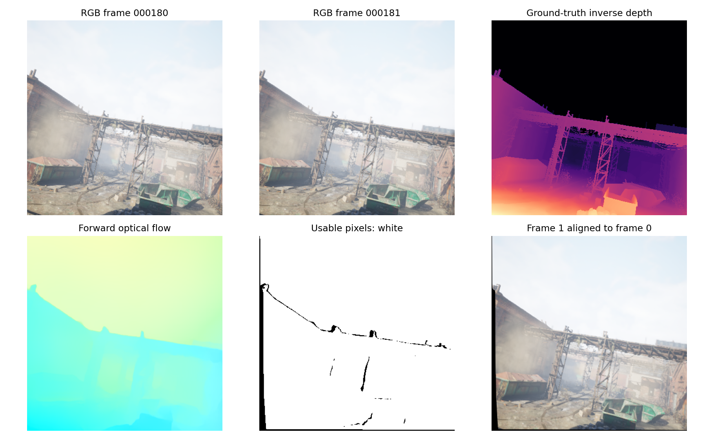
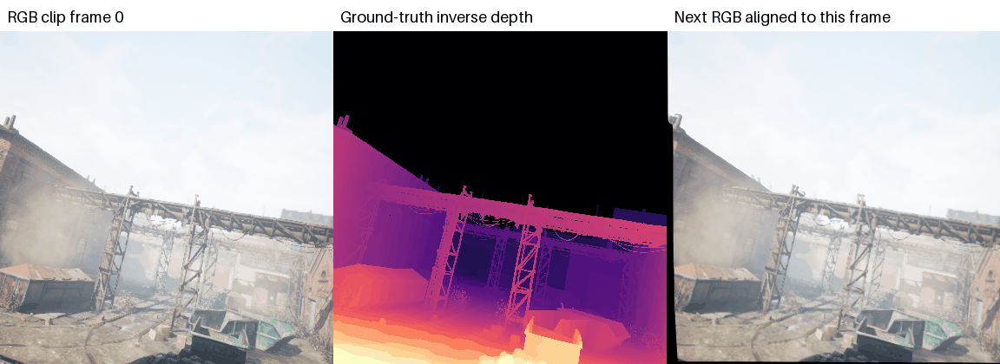

# 第二课完成过程：从视频文件到模型输入

本课的目标是准备训练数据。图片和深度标签来自 TartanAir，光流来自已经训练好的 GMFlow。下面按“输入是什么 → 做了什么 → 输出是什么”说明。

## 第一步：确认数据和环境

服务器 `/home/dancer/tu/video-depth-course` 使用现有 `vita` 环境。Python 3.10.8、PyTorch 1.13.0，GPU 为 RTX 3090。本次使用服务器 GPU 1 进行光流推理，没有训练深度模型。

RGB 文件形如 `000000_left.png`，数据形状为 `[480,640,3]`。同编号的深度文件为 `000000_left_depth.npy`，形状为 `[480,640]`。

数据共有 24 段视频，包含 abandonedfactory、carwelding、office 三个场景。核对后发现 abandonedfactory/P005 有 1007 张 RGB，而只有前 200 张有深度；所以总数是 5607 张 RGB、4800 对 RGB-D，有 807 张 RGB 缺少深度标签。程序按帧编号配对，不直接把两个列表按位置强行配在一起，也不删除原始数据。

## 第二步：给相邻图片计算光流

读取已经训练好的 `gmflow_things-e9887eda.pth` 权重，使用严格匹配载入，并对所有相邻帧进行推理。

例如第 0、1 帧作为一对：前向光流告诉我们第 0 帧的像素在第 1 帧在哪里，后向光流告诉我们如何从第 1 帧找回第 0 帧。用二者一致性检查得到掩码，标记可能遮挡、越界或匹配不可靠的位置。

一段 N 帧视频有 N−1 对相邻帧。5607 张 RGB 分布在 24 段视频中，所以共有 `5607−24=5583` 对。每对有四个输出，最终生成并核对了 `5583×4=22332` 个 `.npy` 文件，光流生成程序退出码为 0。

四个输出都用一对中较早那一帧命名。`b_flow/000000_left.npy` 保存的是第 1 帧回到第 0 帧的位移。因此读取某帧的后向光流时，要取前一帧编号的文件。

## 第三步：把连续帧组成样本

`dataset.py` 将有深度标签的连续帧分成每段 12 帧的片段。一个片段包含 12 张 RGB、12 张逆深度、11 张前向光流、11 张后向光流和两组各 11 张掩码。

每条轨迹最后一个完整片段留作验证，其余用于训练。得到 360 个训练片段、24 个验证片段；共使用 4608 个 RGB-D 帧，另有 192 个尾部帧不足 12 帧而未使用。训练和验证片段没有共用帧。

这里的验证集仍来自同一批轨迹，适合课堂检查；这不是独立场景上的泛化评测。

## 第四步：同步处理图片和标签

图片由 0～255 缩放到 −1～1；深度取倒数，变成“近处数值大、远处数值小”的逆深度。参考代码把它称为视差，但本实现明确使用 `1/D`，没有引入双目相机焦距或基线。

训练时随机缩放、水平翻转、裁剪，并让 RGB、深度、光流和掩码保持同一个空间位置。原始随机缩放提示容易让人误解：改变图片分辨率需要改变光流的像素位移，但不会改变物体到相机的真实距离，因此逆深度标签不乘缩放系数。

具体处理规则：

| 操作 | RGB / 逆深度 | 光流 | 掩码 |
|---|---|---|---|
| 缩放 | 双线性插值，逆深度数值不额外缩放 | `u` 乘宽比例，`v` 乘高比例 | 最近邻插值，保持 0/1 |
| 水平翻转 | 同步左右翻转 | 同步翻转，`u` 变号 | 同步翻转 |
| 裁剪 | 使用同一裁剪框 | 使用同一裁剪框 | 同步裁剪，并排除对应点越界的位置 |

训练时缩放比例在 0.8～0.85，最终裁剪到 384×384。验证时保持原始分辨率，只中心裁剪到 384×384，不采用随机增强。

原始 GMFlow 掩码的 1 表示不可靠。数据层做 `1-mask`，得到“1 可以计算、0 不参与计算”的可用掩码。因此原始掩码和过程图中的白色含义不同，图标题已经标明。

## 第五步：送入 PyTorch

PyTorch 图像通常把颜色通道放在高、宽之前，视频再增加时间维度。一个样本的 RGB 为 `[12,3,384,384]`，两个样本组成一个批次则为 `[2,12,3,384,384]`。

| 批次字段 | 实测形状 | 含义 |
|---|---|---|
| image | `[2,12,3,384,384]` | 两段视频，每段 12 帧，每帧 RGB |
| depth | `[2,12,1,384,384]` | 对应的真实逆深度标签 |
| f_flows / b_flows | `[2,11,2,384,384]` | 11 对帧的 `u,v` 位移 |
| f_masks / b_masks | `[2,11,1,384,384]` | 11 对帧的可用像素 |

这些都是 float32 张量。实际读取了一个批次，并成功将六组张量传入 GPU。

## 第六步：用真实图片检查运动对齐



上排从左到右：第 180 帧 RGB、第 181 帧 RGB、第 180 帧的真实逆深度。下排从左到右：前向光流、可用像素、把第 181 帧按第 180 帧位置排列后的图片。

在可用像素上，RGB 平均绝对差由对齐前的 0.03685 降到对齐后的 0.01197。该结果支持“对应位置找到了、运动对齐能工作”，但不是深度模型的预测精度。右下角图片的颜色来自下一帧，并非生成的未来图片。

连续帧展示：



左侧是已有视频帧，中间是已有真实深度的倒数，右侧是下一帧运动对齐到当前帧的结果。

## 验证内容与复现入口

`check_data.py` 检查了随机缩放的位移数值、翻转方向、二值掩码、采样器分配不重不漏、训练/验证帧不重叠、RGB 范围、逆深度数值、后向文件索引、批次形状和 GPU 传输。`--audit` 还检查每条轨迹四个输出目录的全部文件名，并抽查首尾输出的内容。

在服务器项目目录运行：

```bash
conda activate vita
CUDA_VISIBLE_DEVICES=1 OMP_NUM_THREADS=4 MKL_NUM_THREADS=4 python check_data.py --audit
```

这条命令重新读取实际数据、验证格式、生成过程图和动画，并把结果保存为 `outputs/lesson2_checks.json`。完整光流生成命令及各参数解释见仓库 README。

最终运行输出为 `PASS`。24 条轨迹的所有预期文件名均齐全，抽查的首尾输出也通过检查；检查记录副本保存为本目录的 `lesson2_checks.json`。

本次代码与说明由 AI 辅助完成。原始课堂代码保存在 `dataset_template.txt`，完成的代码位于仓库根目录 `dataset.py`。
